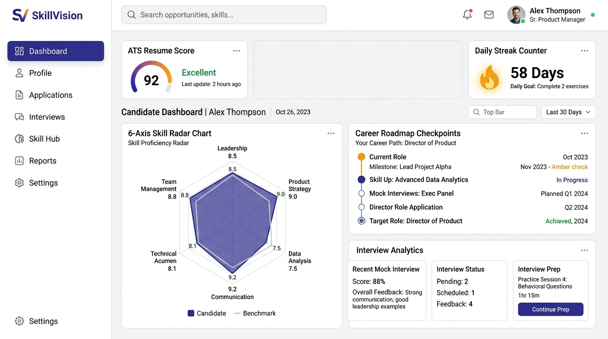
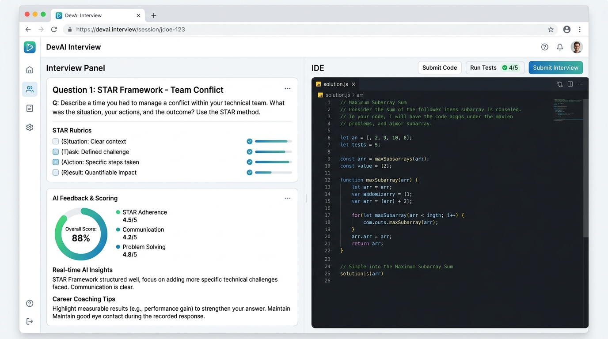
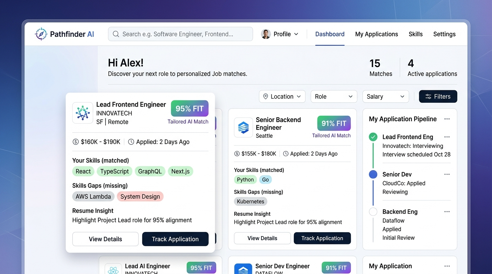

# 🚀 SkillVision — AI-Powered Career Copilot & Placement Platform

[](https://reactjs.org/)
[](https://www.typescriptlang.org/)
[](https://vitejs.dev/)
[](https://tailwindcss.com/)
[](https://ai.google.dev/)
[](https://expressjs.com/)
[](https://opensource.org/licenses/MIT)

**SkillVision** is an intelligent, full-stack career development and interview preparation ecosystem. Powered by **Google Gemini 2.5**, it bridges the gap between candidate qualifications and hiring benchmarks with real-time resume parsing, automated ATS scoring, personalized milestone roadmaps, technical & behavioral mock interview loops, interactive coding playgrounds, and AI-driven job matching.

---

## 📸 Application Previews

### 1. Executive Placement Cockpit & Analytics Dashboard
An all-in-one control center showing ATS resume scoring, a 6-axis dynamic skill radar, daily streaks, personalized learning milestones, and candidate analytics.



---

### 2. AI Technical & Mock Interview Arena
A full simulation environment with structured behavioral STAR questions, live code execution editor, instant AI critique, and on-demand confidence coaching tips.



---

### 3. AI Job Matching & Career Opportunity Hub
Match-making engine calculating percentage fit, highlighting missing vs. matched skill competencies, providing custom resume tailoring tips, and tracking application pipelines.



---

## 🌟 Key Features

### 📄 1. ATS Resume Analyzer & Parser
- **Instant Extraction**: Extracts candidate contact info, experience, target roles, technical skills, and educational background.
- **Deep ATS Auditing**: Provides a quantifiable 0–100 ATS compatibility score, structural formatting analysis, keyword density feedback, and missing high-priority skill recommendations.

### 🧭 2. Dynamic Career Roadmaps
- **Adaptive Milestones**: Synthesizes custom step-by-step career progression tracks based on current qualifications and dream job targets.
- **Interactive Checkpoints**: Track learning tasks, project completions, and practice goals in real time.

### 🎯 3. 6-Axis Interactive Skill Radar
- **Visual Competency Benchmark**: Visualizes candidate proficiencies across Frontend, Backend, Cloud/DevOps, Architecture/System Design, Problem Solving/DSA, and Behavioral/Communication.
- **Dynamic Level Gauging**: Updates live as you complete assessments, projects, and interview drills.

### 🎙️ 4. AI Mock & Technical Interview Coach
- **Behavioral STAR Grading**: Evaluates candidate answers on *Situation, Task, Action, and Result* with actionable improvement suggestions.
- **Interactive Coding Studio**: Built-in coding arena with syntax-highlighted code editor and AI review for data structures, algorithms, and system design.
- **Quick AI Interview Tips**: 3 randomized, high-impact career advice snippets with one-click copy and instant regeneration.

### 💼 5. Smart Job Matching Hub
- **Semantic Job Fit**: Automatically ranks open roles against candidate skill profiles with detailed match percentage breakdowns.
- **Resume Tailoring Assistant**: Generates tailored bullet points to optimize applications for specific job descriptions.

### 🔥 6. Daily Consistency Streak Counter
- **Gamified Habits**: Tracks consecutive active days, personal best records, and a rolling 7-day visual timeline.
- **Multi-Activity Logging**: Automatically increments streak on roadmap tasks, quizzes, mock interviews, or resume updates.

---

## 🛠️ Tech Stack & Architecture

| Layer | Technology |
|---|---|
| **Frontend Framework** | React 18 with TypeScript & Vite |
| **Styling & Design System** | Tailwind CSS v4, Lucide React Icons |
| **Animations & Transitions** | Motion (`motion/react`) |
| **Backend & API Server** | Node.js with Express & TypeScript (`tsx`) |
| **AI Intelligence Engine** | Google Gen AI SDK (`@google/genai`) using Gemini 2.5 Flash |
| **Data Persistence** | File-based local JSON database (`db.json`) with auto-persistence |

---

## ⚡ Getting Started

### Prerequisites
- Node.js (v18.0.0 or higher)
- npm or bun
- A Google Gemini API Key ([Get a free key at Google AI Studio](https://aistudio.google.com/))

### Installation

1. **Clone the repository:**
   ```bash
   git clone https://github.com/Somesh4206/SkillVision.git
   cd SkillVision
   ```

2. **Install dependencies:**
   ```bash
   npm install
   ```

3. **Configure Environment Variables:**
   Create a `.env` file in the root directory (based on `.env.example`):
   ```env
   GEMINI_API_KEY=your_google_gemini_api_key_here
   ```

4. **Start the Development Server:**
   ```bash
   npm run dev
   ```
   Open [http://localhost:3000](http://localhost:3000) in your browser.

5. **Build for Production:**
   ```bash
   npm run build
   npm start
   ```

---

## 📁 Project Structure

```text
SkillVision/
├── docs/
│   └── images/                     # UI Screenshots & Documentation Assets
│       ├── dashboard-preview.jpg
│       ├── interview-preview.jpg
│       └── job-matcher-preview.jpg
├── server/
│   ├── agents.ts                   # Gemini 2.5 AI agent pipelines & prompts
│   └── db.ts                       # Local JSON database engine & streak store
├── src/
│   ├── components/
│   │   ├── DailyStreakCounter.tsx  # Gamified 7-day streak tracker
│   │   ├── GoogleAuthDialog.tsx    # Auth modal & Google OAuth UI
│   │   ├── GoogleSignInButton.tsx  # Google Sign-in button
│   │   ├── JobMatchingHub.tsx      # Job board, fit score & tailoring
│   │   ├── QuickInterviewTips.tsx  # AI randomized advice snippets
│   │   ├── SkillRadarChart.tsx     # 6-axis canvas radar visualization
│   │   └── UserProfileModal.tsx    # Profile & target career editor
│   ├── App.tsx                     # Main application view & tab router
│   ├── index.css                   # Tailwind CSS styling configuration
│   └── main.tsx                    # React client entry point
├── server.ts                       # Full-stack Express server with Vite middleware
├── package.json                    # Dependencies & build scripts
├── vite.config.ts                  # Vite configuration
└── README.md                       # Project documentation
```

---

## 🤝 Contributing

Contributions, issues, and feature requests are welcome! Feel free to check the [issues page](https://github.com/Somesh4206/SkillVision/issues).

---

## 📄 License

This project is licensed under the [MIT License](LICENSE).
